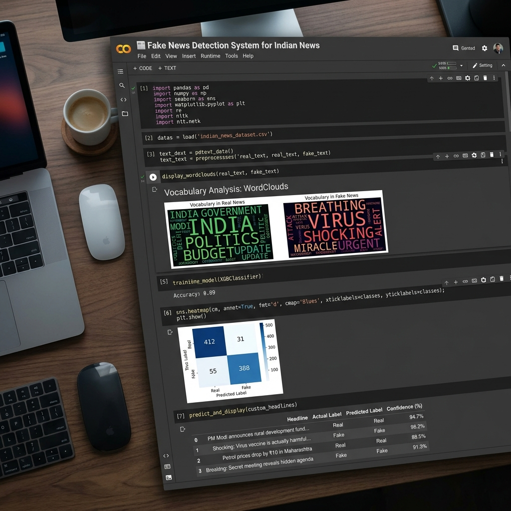
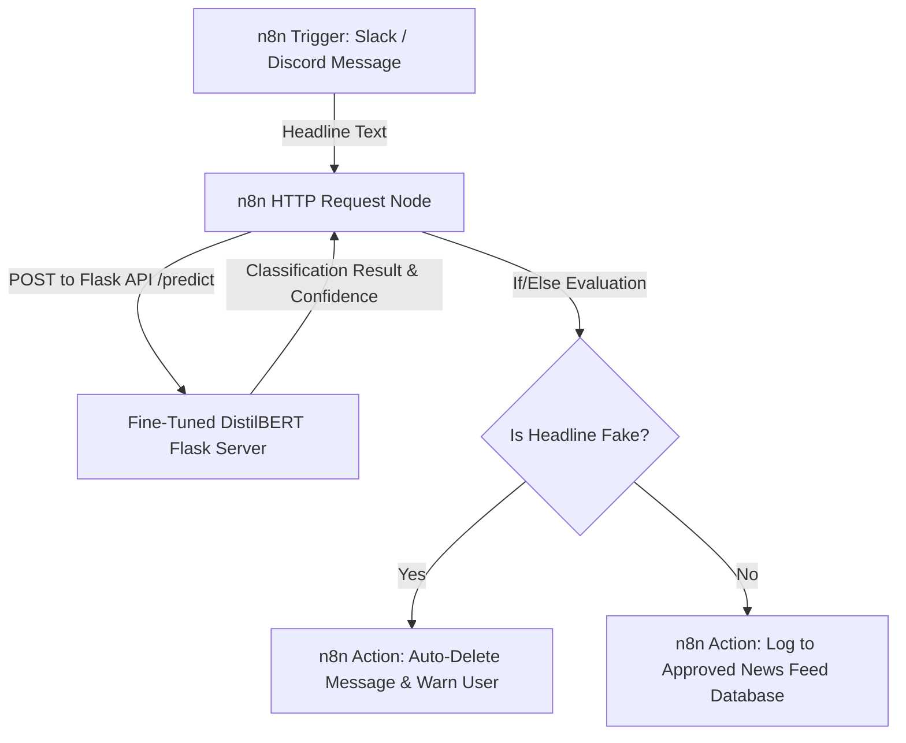

# 📰 Fake News Detection for Indian News using Fine-Tuned BERT with Explainable AI (XAI)

[](LICENSE)
[](https://www.python.org/)
[](https://pytorch.org/)
[-yellow?logo=huggingface)](https://huggingface.co/distilbert-base-uncased)

An end-to-end, production-grade Natural Language Processing (NLP) pipeline that fine-tunes a pre-trained **DistilBERT** transformer model to classify Indian news headlines as **Real** or **Fake**. 

This repository features advanced **Explainable AI (XAI)** capabilities by extracting and visualizing the model's self-attention weights to highlight the exact words that influenced the classification decision.

---

## 📸 Interface Preview

Here is a visual preview of the Google Colab Notebook interface and execution outputs:



---

## 🌟 Key Features

* 🧠 **Explainable AI (XAI) Self-Attention Visualizer**: 
  - Extracts self-attention matrices from the final layer of the transformer model.
  - Calculates the average attention allocated by the `[CLS]` token to all other tokens.
  - Dynamically highlights words in **Red (for Fake)** or **Green (for Real)** with opacity matching their relative attention scores, showing exactly *why* the model made its choice.
* 🎨 **Interactive Jupyter Widget Dashboard**:
  - Embeds a clean, styled HTML/CSS GUI dashboard inside Google Colab using `ipywidgets`.
  - Allows users to enter headlines and view real-time confidence scores and attention highlights instantly.
* 🇮🇳 **Synthetic Indian Context Dataset**:
  - Programmatically generates **700 balanced headlines** (350 Real, 350 Fake).
  - Coined around Indian contexts: space (**ISRO**), banking (**RBI**), sports (**IPL/BCCI**), politics, and Bollywood.
  - Mimics typical clickbaits and WhatsApp hoaxes (e.g., GPS note microchips, fake UNESCO announcements).
* 📊 **Exploratory Data Analysis (EDA)**:
  - Renders vocabulary **WordClouds** (Green for Real, Red for Fake) with custom stopword filters.
  - Plots sentence length distributions using `Seaborn`.
* 🤖 **Hugging Face Fine-Tuning Pipeline**:
  - Built on PyTorch custom `Dataset` loaders and Hugging Face's `Trainer` API.
  - Implements learning rate scheduling, warmup steps, and checkpoint saving.
* 📈 **Robust Metrics Dashboard**:
  - Plots training/validation loss curves.
  - Renders a clean Seaborn heatmap confusion matrix.
  - Outputs complete metrics reports (Precision, Recall, F1-Score, and Accuracy).

---

## 🗺️ System Architecture

```text
       [ Indian News Headline ]
                  │
                  ▼
      [ DistilBERT Tokenization ] (Max Length = 64)
                  │
                  ▼
    [ Fine-Tuned DistilBERT Model ] (Trained on T4 GPU)
         /                     \
        /                       \
       ▼                         ▼
 [ Logit Predictions ]     [ Self-Attention Weights ] (Last Layer)
       │                         │
       ▼ (Softmax)               ▼ (Mean across Heads)
 [ Probabilities ]         [ CLS-to-Token Weights ]
       │                         │
       ▼                         ▼ (Min-Max Normalized)
 [ Real vs Fake Class ] ──► [ HTML Attention Highlighter ]
                  │
                  ▼
      [ Interactive UI Result Card ]
```

---

## 🚀 How to Run in Google Colab

1. **Download** the notebook: [`Fake_News_Detection_Indian_News.ipynb`](Fake_News_Detection_Indian_News.ipynb).
2. **Open** [Google Colab](https://colab.research.google.com/).
3. **Upload** the notebook (`File > Upload notebook`).
4. **Enable GPU Acceleration**:
   - Go to `Runtime > Change runtime type` in the top menu.
   - Select **T4 GPU** under *Hardware accelerator* and click **Save**.
5. **Run all cells** sequentially (`Runtime > Run all` or `Ctrl + F9`).

---

## 📊 Model Training & Hyperparameters

The model is fine-tuned on the synthetic Indian news dataset with the following parameters:

| Hyperparameter | Value | Description |
| :--- | :--- | :--- |
| **Base Model** | `distilbert-base-uncased` | Lightweight BERT model (66M parameters) |
| **Epochs** | 3 | Full passes over the training dataset |
| **Batch Size** | 16 | Training & Evaluation batch size |
| **Learning Rate** | Default AdamW | Managed by Hugging Face Trainer |
| **Warmup Steps** | 50 | Steps to increase learning rate gradually |
| **Weight Decay** | 0.01 | L2 regularization rate to prevent overfitting |
| **Validation Split** | 20% (Stratified) | Evaluates performance on unseen dataset |

---

## 💻 Running Locally (Optional Flask App)

If you want to view the detector inside your local web browser:

1. **Install requirements**:
   ```bash
   pip install flask transformers torch
   ```
2. **Start the Flask server**:
   ```bash
   python app.py
   ```
3. Open **`http://localhost:5000`** in Chrome to interact with the web app UI!

---

## 🤖 n8n Automated Social Media Moderation (Optional)

You can scale this DistilBERT Fake News Detector into a live social media auto-moderation pipeline using **n8n**. By connecting Slack, Discord, or webhooks, you can automatically intercept posts, classify headlines in real time, and auto-delete fake news.

### 🚀 Easy 1-Click Workflow Import
We have included a pre-configured n8n workflow JSON file in this repository: [n8n_workflow.json](n8n_workflow.json).
To use it:
1. **Open n8n** (Cloud or Local instance).
2. Create a **New Workflow**.
3. Click the menu icon (top right corner) and select **Import from File**.
4. Choose the `n8n_workflow.json` file from this project.
5. Your flow is automatically configured! Just set the Flask Server URL in the `HTTP Request` node.

### n8n Moderation Architecture


### Steps to implement manually in n8n:
1. **Trigger**: Set up a `Slack` or `Discord` listener node triggered on "On New Message" in a specific channel.
2. **Classifier API Link**: Add an `HTTP Request` node configured to make a `POST` request to your Flask API (`http://localhost:5000/predict` or your deployed URL) sending the message body as:
   ```json
   {
     "headline": "{{ $json.message }}"
   }
   ```
3. **Decision Node**: Add an `If` node to check if the classification returned from the API equals `Fake`.
4. **Auto-Moderation**: 
   - If **True**: Trigger a Slack/Discord API action to delete the offending message and send an automated warning DM to the sender.
   - If **False**: Pass the verified headline to an approved news channel.

---

## 📁 Repository Directory Structure

```text
├── Fake_News_Detection_Indian_News.ipynb  # Primary Google Colab Jupyter Notebook
├── generate_notebook.py                   # Script used to compile the notebook JSON
├── app.py                                 # Local Flask application for web hosting
├── templates/
│   └── index.html                         # Flask web UI templates
├── resume_content.md                      # Resume bullet points for portfolio highlight
├── README.md                              # Repository documentation
└── .gitignore                             # Git exclusion rules
```

---

## 📜 License

This project is open-source and licensed under the [MIT License](LICENSE).
